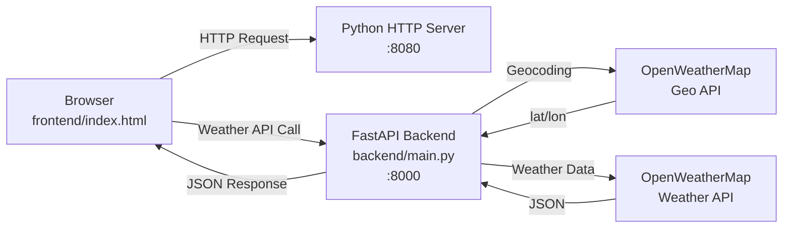
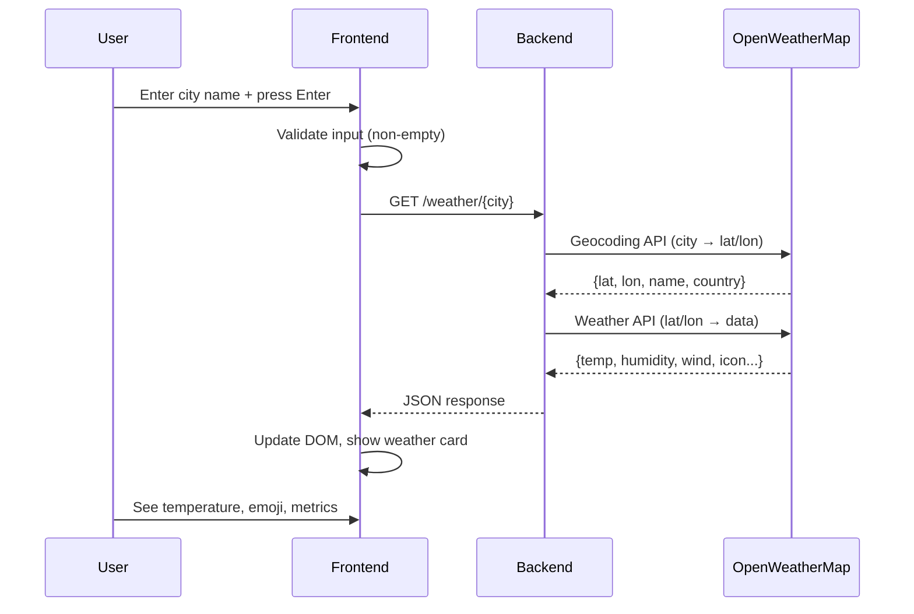

# ☁️ WeatherNow

A full-stack weather application with a FastAPI backend and vanilla JavaScript frontend, powered by OpenWeatherMap.


---

## 🏗️ System Architecture



### Data Flow

```
┌─────────────┐     ┌──────────────┐     ┌─────────────────────┐
│   Browser   │────▶│  Frontend    │────▶│   FastAPI Backend   │
│  :8080      │     │  script.js   │     │   main.py :8000     │
│             │◀────│  fetch()     │◀────│   httpx + OpenWeather│
└─────────────┘     └──────────────┘     └─────────────────────┘
                            │                      │
                            │                      ├─▶ Geocoding API
                            │                      │  (city → lat/lon)
                            │                      │
                            │                      └─▶ Weather API
                            │                         (lat/lon → data)
                            │
                            ▼
                     ┌──────────────┐
                     │  User sees   │
                     │  Weather Card │
                     └──────────────┘
```

---

## 🧩 Tech Stack

| Layer | Technology | Purpose |
|-------|-----------|---------|
| **Backend** | FastAPI 0.104.1 | REST API framework |
| **Server** | Uvicorn 0.24.0 | ASGI server |
| **HTTP Client** | httpx 0.25.2 | Async HTTP calls to OpenWeatherMap |
| **Config** | python-dotenv 1.0.0 | Environment variable management |
| **Frontend** | HTML5 + CSS3 + Vanilla JS | UI without frameworks |

---

## 📂 Project Structure

```
WEATHER_APPS/
├── backend/
│   ├── main.py          # FastAPI application
│   └── .env             # OpenWeatherMap API key
├── frontend/
│   ├── index.html       # Main HTML structure
│   ├── style.css        # Dark theme styling
│   └── script.js        # API calls & DOM manipulation
├── lkr/                 # Python virtual environment
└── requirements.txt     # Python dependencies
```

---

## 🔧 Backend Code

### `backend/main.py`

```python
from pathlib import Path
import os

import httpx
from dotenv import load_dotenv
from fastapi import FastAPI, HTTPException
from fastapi.middleware.cors import CORSMiddleware

# Load .env from same directory as main.py
load_dotenv(Path(__file__).with_name(".env"))

app = FastAPI()

# Allow cross-origin requests from frontend
app.add_middleware(
    CORSMiddleware,
    allow_origins=["*"],
    allow_methods=["*"],
    allow_headers=["*"],
)

# API key from environment (never exposed to frontend)
OPENWEATHER_API_KEY = os.getenv("OPEN_WEATHER_API_KEY")

@app.get("/")
def home():
    return {"message": "Weather API is running with OpenWeatherMap!"}

@app.get("/weather/{city}")
async def get_weather(city: str):
    # Step 1: Geocoding - city name to coordinates
    geo_url = "https://api.openweathermap.org/geo/1.0/direct"
    geo_params = {"q": city, "limit": 5, "appid": OPENWEATHER_API_KEY}
    
    async with httpx.AsyncClient(timeout=20.0) as client:
        geo_response = await client.get(geo_url, params=geo_params)
    
    if geo_response.status_code != 200:
        raise HTTPException(status_code=500, detail="Geocoding service error")
    
    geo_data = geo_response.json()
    if not geo_data:
        raise HTTPException(status_code=404, detail="City not found")
    
    loc = geo_data[0]
    lat, lon, name, country = loc["lat"], loc["lon"], loc["name"], loc.get("country", "")
    
    # Step 2: Weather data using coordinates
    weather_url = "https://api.openweathermap.org/data/2.5/weather"
    weather_params = {"lat": lat, "lon": lon, "units": "metric", "appid": OPENWEATHER_API_KEY}
    
    async with httpx.AsyncClient(timeout=20.0) as client:
        weather_response = await client.get(weather_url, params=weather_params)
    
    if weather_response.status_code != 200:
        raise HTTPException(status_code=500, detail="Weather service error")
    
    w = weather_response.json()
    main = w.get("main", {})
    weather = w.get("weather", [{}])[0]
    wind = w.get("wind", {})
    
    return {
        "city": name,
        "country": country,
        "temperature": round(main.get("temp", 0)),
        "feels_like": round(main.get("feels_like", 0)),
        "humidity": main.get("humidity", 0),
        "wind_speed": round(wind.get("speed", 0) * 3.6),  # m/s → km/h
        "visibility": round(w.get("visibility", 10000) / 1000),  # m → km
        "description": weather.get("main", "Unknown"),
        "icon": weather.get("icon", "01d")
    }
```

### Code Breakdown

| Section | Lines | Purpose |
|---------|-------|---------|
| Imports & Config | 1–22 | Load env, initialize app, configure CORS |
| Home Endpoint | 24–26 | Health check route |
| Geocoding | 33–58 | Convert city name to lat/lon |
| Weather Fetch | 60–75 | Get live weather using coordinates |
| Response Mapping | 77–93 | Transform API response to frontend format |

**Key Design Decisions:**
- API key stays on backend — never exposed to browser
- Two-step API flow: city → coordinates → weather
- `httpx.AsyncClient` for non-blocking I/O
- CORS wildcard (`*`) for local development

---

## 🎨 Frontend Code

### `frontend/index.html`

Semantic HTML5 with structured weather display: search box, error container, loader, and weather card grid.

### `frontend/style.css`

Dark theme (`#0f0f1a` background) with:
- Flexbox layout for `.app-wrapper`
- CSS Grid for `.details-grid` (4 metrics)
- Animations: `fadeIn` for weather card
- Responsive `max-width: 420px`

### `frontend/script.js`

```javascript
const BACKEND_URL = "http://127.0.0.1:8000";

// OpenWeatherMap icon codes → emoji
const iconMap = {
  "01d": "☀️", "01n": "🌙", "02d": "⛅", "02n": "☁️",
  "03d": "☁️", "03n": "☁️", "04d": "☁️", "04n": "☁️",
  "09d": "🌧️", "10d": "🌦️", "11d": "⛈️", "13d": "❄️", "50d": "🌫️"
};

async function getWeather() {
  const city = document.getElementById("cityInput").value.trim();
  loader.style.display = "block";
  
  try {
    const response = await fetch(
      `${BACKEND_URL}/weather/${encodeURIComponent(city)}`
    );
    
    if (!response.ok) throw new Error("City not found");
    const data = await response.json();
    displayWeather(data);
    
  } catch (error) {
    errorMsg.style.display = "block";
    errorMsg.textContent = "⚠️ Cannot connect to server!";
  } finally {
    loader.style.display = "none";
  }
}

function displayWeather(data) {
  document.getElementById("temperature").textContent = `${data.temperature}°C`;
  document.getElementById("weatherEmoji").textContent = iconMap[data.icon] || "🌡️";
  document.getElementById("weatherCard").style.display = "block";
}
```

---

## ⚙️ Environment Variables

Create `backend/.env`:

```env
OPEN_WEATHER_API_KEY=your_api_key_here
```

Get a free key at: https://openweathermap.org/api

---

## ▶️ Workflow



### Step-by-Step Workflow

1. **User enters city** in search input (`index.html`)
2. **Frontend validates** input is not empty (`script.js:getWeather()`)
3. **HTTP GET request** sent to `http://127.0.0.1:8000/weather/{city}` (`script.js:55`)
4. **Backend receives** request at `/weather/{city}` endpoint
5. **Geocoding step**: OpenWeatherMap `/geo/1.0/direct` converts city name to `lat`, `lon`
6. **Weather step**: OpenWeatherMap `/data/2.5/weather` fetches current conditions
7. **Backend transforms** response: converts m/s → km/h, m → km, rounds values
8. **Frontend receives** JSON with city, temp, humidity, wind, icon code
9. **Frontend maps** icon code (e.g. `01d`) to emoji (☀️) via `iconMap`
10. **DOM updates**: weather card becomes visible with all metrics

---

## 🚀 Quick Start

```bash
# 1. Install dependencies
python -m pip install -r requirements.txt

# 2. Run backend (Terminal 1)
cd backend
python -m uvicorn main:app --host 0.0.0.0 --port 8000 --reload

# 3. Run frontend (Terminal 2)
cd frontend
python -m http.server 8080

# 4. Open browser
start http://localhost:8080
```

### Verify Backend

```bash
# Health check
curl.exe http://127.0.0.1:8000/

# Weather query
curl.exe "http://127.0.0.1:8000/weather/London"
```

Expected output:
```json
{
  "city": "London",
  "country": "GB",
  "temperature": 18,
  "feels_like": 17,
  "humidity": 72,
  "wind_speed": 14,
  "visibility": 10,
  "description": "Clouds",
  "icon": "04d"
}
```

---

## 🔌 API Reference

### `GET /`
Returns health status.

**Response:**
```json
{"message": "Weather API is running with OpenWeatherMap!"}
```

### `GET /weather/{city}`

Fetch current weather for a city.

**Parameters:**
| Name | Type | Description |
|------|------|-------------|
| `city` | string | City name (e.g. `London`, `Kolkata`) |

**Success Response (200):**
```json
{
  "city": "London",
  "country": "GB",
  "temperature": 18,
  "feels_like": 17,
  "humidity": 72,
  "wind_speed": 14,
  "visibility": 10,
  "description": "Clouds",
  "icon": "04d"
}
```

**Error Responses:**
| Code | Condition |
|------|-----------|
| 404 | City not found by OpenWeatherMap |
| 500 | OpenWeatherMap API error or missing API key |

---

## 🛠️ Troubleshooting

| Issue | Solution |
|-------|----------|
| `OPEN_WEATHER_API_KEY missing` | Add key to `backend/.env` |
| `ModuleNotFoundError` | Run `pip install -r requirements.txt` |
| CORS error in browser | Backend CORS middleware allows `*` — ensure backend is running |
| City not found | Use English city names, try major cities first |
| Port 8000 in use | Change port in uvicorn command: `--port 8001` |
